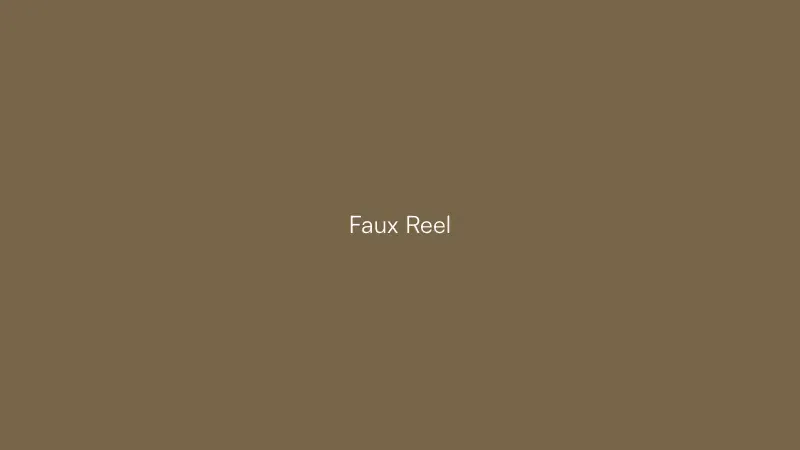

# Faux Reel

**A sizzle reel with no video in it.** Give it a stack of still photos and it cuts
them together, fast enough that your eye reads motion: wipes, blinks, a burn flash,
a title card. It is all CSS. No video files, no dependencies.

Drop it in a pitch deck, a portfolio, a landing page. Anywhere a still could use the
energy of a video, without shooting, editing, or hosting one. If you are a developer
or product manager who wants that without a motion designer on call, it is built for you.



Made by [Reckon House Staples](https://reckon.house). The full story:
[reckon.house/case-studies/sizzle](https://reckon.house/case-studies/sizzle).

---

## Why I made this

I wanted that look, just not the editing behind it.
Quick sizzle clips kept coming up: an intro card, a social reel, a little motion
for product marketing, a project thumbnail. So I built the simplest thing that could
partially fake it. A stack of stills, cut fast enough to read as motion, with no
timeline and nothing to render.

That is all this is. It is not out to replace real editing, and it is not trying to.
It is for when "moving" is enough, and you would rather spend ten minutes than an
afternoon.

## Try it in 10 seconds (no build)

Hit the green **Code → Download ZIP** button up top, unzip, and open **`index.html`**
in your browser. Drop in your own photos, tweak the palette and title, and copy the
embed code when you like it. Everything runs on your machine. Nothing uploads,
nothing is saved.

## Put it on your own site

The drop-in is a Web Component. Copy `sizzle-reel.js` next to your page:

```html
<script src="sizzle-reel.js"></script>

<sizzle-reel
  images="a.jpg, b.jpg, c.jpg, d.jpg, e.jpg"
  colors="#0AA7CA, #181B17, #776549"
  headline="Your headline"
  aspect="16 / 9"
  radius="18px"
></sizzle-reel>
```

Point `images` at any URLs. That is the whole install. Zero dependencies, ~17KB.

| Attribute | What it does |
|-----------|--------------|
| `images`  | Comma-separated image URLs (2 to 8 works best) |
| `colors`  | Comma-separated hex colors for the flash and title frames |
| `headline`| Optional. 1 to 2 words slide in; 3+ scatter through the loop, then build |
| `aspect`  | CSS aspect-ratio, e.g. `16 / 9` or `1 / 1` |
| `radius`  | Corner radius, e.g. `18px` |

## Use it in React

`react/SizzleReel.tsx` is the same engine as a single component. Its only dependency
is React.

```tsx
import { SizzleReel } from "./SizzleReel";

<SizzleReel
  images={["a.jpg", "b.jpg", "c.jpg"]}
  colors={["#0AA7CA", "#181B17", "#776549"]}
  headline="Your headline"
  style={{ aspectRatio: "16 / 9", borderRadius: 18 }}
/>;
```

## Export a GIF or MP4

Need a file instead of live JS (for a post, a deck, an email)? `export/` has a small
Node script that renders the loop to a seamless GIF and MP4. It needs Node,
`playwright-core`, and `ffmpeg`. See [`export/README.md`](export/README.md). Optional,
and a bit more involved than the rest.

---

## How it works

The reel is a list of **beats**, and each beat is a transition: wipes (shutter,
curtain, slats), a cream **burn** blink, a lens **pinch**, solid color frames, and
title cards where the words build in. The trick is the *hidden cut*. A blink or a
pinch swaps the photo while the cover is opaque, so you never see the swap. You just
feel the motion. The timings are tuned so a still gets read as a frame of video.

Want to change it? It all lives in `buildSequence`, the beat list, in the React file
and the web component. Retime it, reorder it, add your own transitions. There is an
[`AGENTS.md`](AGENTS.md) if you would rather hand it to an AI agent and have it
reshaped to fit your project.

## License

[MIT](LICENSE). Take it and do anything you like. The photos in `sample/` are just
the demo set, so bring your own when you ship. If you make something with it, I would
love to see it.
